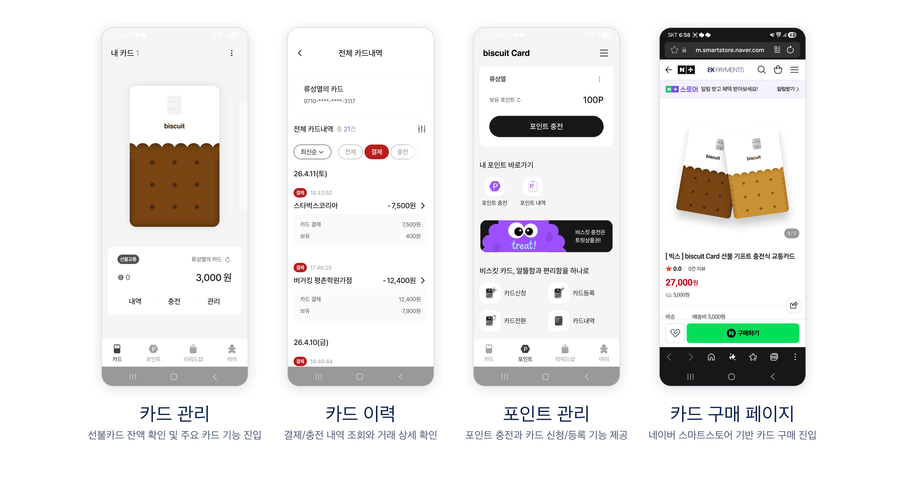
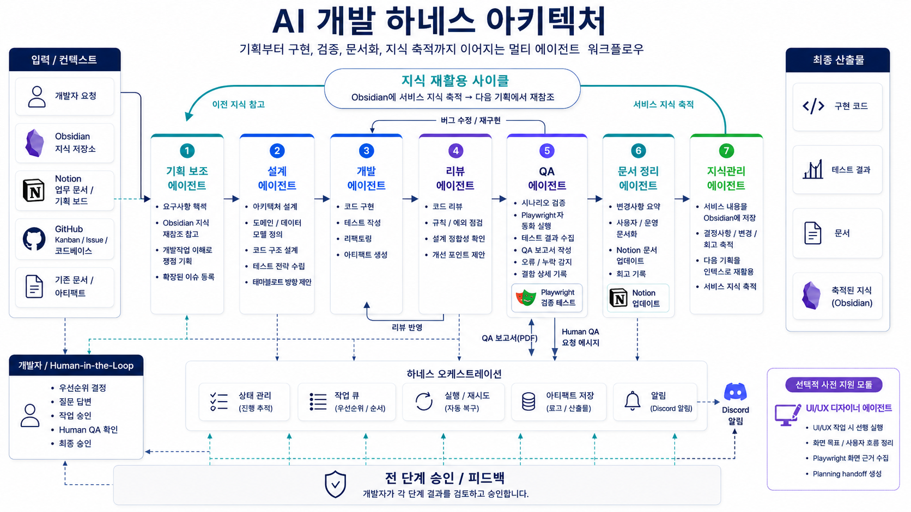
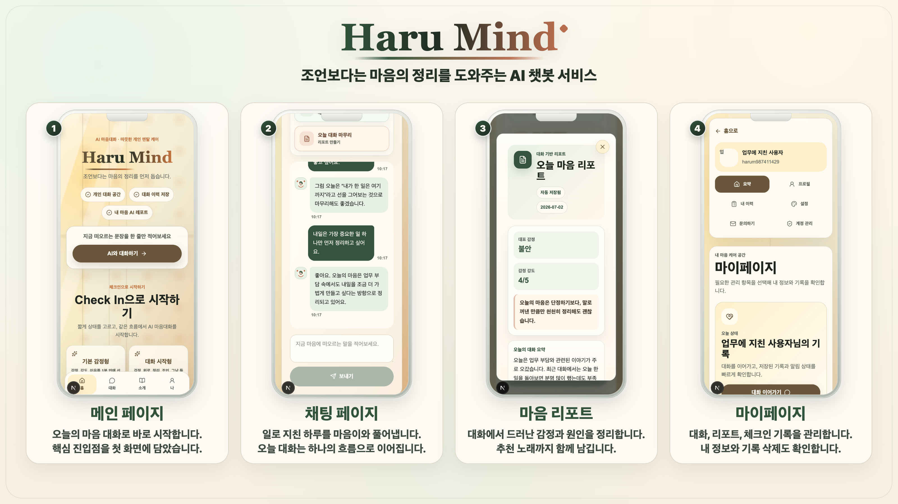

# 류성열 | Backend Developer

안녕하세요!  
Kotlin 기반의 백엔드 개발자 류성열입니다.  
핀테크 스타트업에서 쌓은 **유연한 커뮤니케이션 역량**과 **AI 활용 능력**으로, Production 배포 속도를 높이는 데 강점이 있습니다.

## 🚀 스타트업 근무 이력

- ✅ 자사 "정산 시스템"과 연동되는 카드 기반 모바일 서비스와 어드민 시스템 초기 개발  
- ✅ MVP 서비스 개발 후 Alpha Test + 시장성 검증 
  - Alpha Test 규모 : 그룹사 임직원 70명
  - 유치한 User 규모 : 35,000명
- ✅ 운영/CS팀과 협업하여 카드 서비스 운영 및 유지보수  
- ✅ 카드 플랫폼 협력사와의 기술 협업 전담  
  - 결제 데이터 유실 장애 대응  
  - 장애 자동 대응 시스템 협력 구축  
  - 카드 결제 파이프라인 구축  
- ✅ AI 기반 워크 플로우 구축 
  - 8단계의 개발팀 Work-Flow 중 5단계에 AI 도입 : 62.5% 준자동화 
  - 설계·검증 능력 개선 및 출시 속도 향상 : 7개월간 116개 Ticket 처리

### 💳 Biscuit Card 서비스 개발

 
### 🛠 Skill Set

<table>
  <tr>
    <th align="left">Area</th>
    <th align="left">Technologies</th>
  </tr>
  <tr>
    <td><strong>Backend Development</strong></td>
    <td>
      
      
      
      
      
      
    </td>
  </tr>
  <tr>
    <td><strong>Data Layer</strong></td>
    <td>
      
      
      
      
    </td>
  </tr>
  <tr>
    <td><strong>Architecture & Design</strong></td>
    <td>
      
      
    </td>
  </tr>
  <tr>
    <td><strong>Infrastructure</strong></td>
    <td>
      
      
      
      
      
    </td>
  </tr>
  <tr>
    <td><strong>Observability</strong></td>
    <td>
      
      
    </td>
  </tr>
  <tr>
    <td><strong>ETC</strong></td>
    <td>
      
      
      
      
      
    </td>
  </tr>
</table>

--- 
## 🧠 AI Skills

**AI를 코드 생성 도구로만 쓰지 않고, 기획·설계·개발·검증 전 과정을 견인하는 개발 파트너로 운영**합니다.  
특히 빠른 실험이 필요한 상황에서 반복 업무를 줄이고, 검증 품질을 높이는 방향으로 적용해 왔습니다.

### 🚀 Haru Mind 1주일 출시 경험
Github Kanban Boaord에 강제된 Work-Flow를 따르는 8개의 Multi-Agent 시스템으로 **Haru Mind** 서비스를 1주일만에 배포했습니다.  

- **서비스 링크** : [Haru Mind](https://my-mental-careweb-production.up.railway.app/)  
- **서비스 레포지토리** : [myMentalCare](https://github.com/passionryu/myMentalCare)  
- **하네스 레포지토리** : [Harness](https://github.com/passionryu/Harness)

  <table>
    <tr>
      <td align="center"><strong>AI Harness 아키텍처</strong> </td>
      <td align="center"><strong>AI 챗봇 기반 MVP 서비스 - Haru Mind </strong> </td>
    </tr>
  </table>

> 🎤 BehinfCon 컨퍼런스 참여 (연사자)  : <a href="https://www.youtube.com/watch?v=Po1S4HBXo6w" target="_blank" rel="noopener noreferrer">“AI를 쓰지 않으면 뒤처지고, AI에만 의존하면 대체된다”</a>

## 📝 More info about Me

### 🏗️ 직접 설계한 시스템 아키텍처 (4개)

<table>
  <tr>
    <td align="center" valign="top" width="50%">
      

         
        <b>힐링스페이스</b> 
        <a href="https://furtive-bard-509.notion.site/Healing-Space-Web-Service-14c83cc537b6801d92e8ec47ccfab4ab?pvs=4">Notion Page</a>
      

    </td>
    <td align="center" valign="top" width="50%">
      

         
        <b>북캘린더</b> 
        <a href="https://faint-lavender-bab.notion.site/AI-Vengers-BookCalendar-AI-1d1bc068c52d8087b61fdf9677abf2b9?source=copy_link">Notion Page</a>
      

    </td>
  </tr>
  <tr>
    <td align="center" valign="top" width="50%">
      

         
        <b>멋쟁이 뉴스 배달부</b> 
        <a href="https://github.com/News-Deliver/Server">GitHub Repository</a>
      

    </td>
    <td align="center" valign="top" width="50%">
      

         
        <b>던전톡</b> 
        <a href="https://github.com/DungeonTalk/dungeontalk-backend">GitHub Repository</a>
      

    </td>
  </tr>
</table>

<strong>📂 참여한 프로젝트 (8개)</strong>

<strong>🦁 멋쟁이 사자처럼 최종 프로젝트 (2025.08.06 ~ 2025.08.26)</strong>

1명의 PM, 2명의 기획자, 3명의 백엔드 개발자(Spring Boot)가 참여한 프로젝트입니다. 
Poc, 백엔드 개발, 개발 문서 정리 및 서비스 발표를 통해 팀의 최우수상 수상에 기여했습니다.

- [팀 저장소 링크](https://github.com/orgs/DungeonTalk/repositories)  
- [팀 문서화 링크](https://github.com/DungeonTalk/dungeontalk-backend/wiki)  
- [서비스 발표 영상](https://youtu.be/I0_8VHwtSKs)  

<strong>🦁 멋쟁이 사자처럼 1차 프로젝트 (2025.07.07 ~ 2025.07.27)</strong>

3명의 백엔드 개발자(Spring Boot)가 참여한 프로젝트입니다. 
팀장, 화면 설계서 & 프로토타입 제작, Web 개발, 백엔드 개발 및 서비스 발표를 통해 팀에 기여했습니다.

- [Web 저장소](https://github.com/News-Deliver/Web)  
- [BE 저장소](https://github.com/News-Deliver/Server)  
- [서비스 발표 영상](https://youtu.be/e8M7uNfBp1c)  
- [프로토타입](https://merry-crepe-479d93.netlify.app/)  
- [화면 설계서](https://www.figma.com/design/b742hXQtI8IqTM3iyirWzR/Untitled?node-id=0-1&p=f&t=BDVVaoSPTOQTkpMc-0)  

<strong>📱 3차 학과 AI 애플리케이션 개발 프로젝트 (2025.03.01 ~ 2025.06.08)</strong>

2명의 AI 개발자, 안드로이드 개발자, 풀스택 개발자(Node.JS), 백엔드 개발자(Spring Boot)가 참여한 프로젝트입니다. 
팀장, 화면 설계서 제작, 문서화(제안서, 설계서, WBS, 완료 보고서), 백엔드 개발 및 서비스 발표를 통해 팀의 프로젝트 성적 A+ 취득에 기여했습니다.

- [서비스 소개 페이지](https://faint-lavender-bab.notion.site/AI-Vengers-BookCalendar-AI-1d1bc068c52d8087b61fdf9677abf2b9?source=copy_link)  
- [화면 설계서](https://www.figma.com/design/ndspvub92U64eh9J2MDZSV/Untitled?node-id=0-1&p=f&t=kKi8mY0w6a20eyZM-0)  
- [BE 저장소](https://github.com/passionryu/BookCalendarServer)  

<strong>🚀 Google Developer Group 해커톤 (2025.02.21 ~ 2025.02.22)</strong>

기획자, 2명의 웹 개발자, 2명의 백엔드 개발자(Spring Boot)가 참여한 프로젝트입니다. 
백엔드 개발 및 Web 개발로 팀의 장려상 수상에 기여했습니다.

- [BE 저장소](https://github.com/passionryu/3rdwagle-team6-back)  
- [FE 저장소](https://github.com/passionryu/3rdwagle-team6-front)  

<strong>🌿Healing Space 개인 프로젝트 (2025.01.01 ~ 2025.03.01)</strong>

 React/Spring Boot 기반의 웹 서비스를 개발 후 Github Actions로 AWS에 배포한 경험을 통해 타 직무에 대한 이해도를 더욱 강화하였습니다. 
다음은 제 개인 프로젝트 🌿Healing Space🌿에 대한 자료 정리 입니다. 

- [BE 저장소](https://github.com/passionryu/Healing-Space-Back)
- [FE 저장소](https://github.com/passionryu/Healing-Space-Front)
- [서비스 링크](http://healing-space-front.s3-website.ap-northeast-2.amazonaws.com)
- [서비스 소개 Notion 페이지](https://furtive-bard-509.notion.site/Healing-Space-Web-Service-14c83cc537b6801d92e8ec47ccfab4ab?pvs=4)

<strong>📱 2차 학과 AI 애플리케이션 개발 프로젝트 (2024.09.05 ~ 2024.11.07)</strong>

2명의 AI 개발자, 안드로이드 개발자, 백엔드 개발자(Spring Boot)가 참여한 프로젝트입니다. 
팀장, 화면 설계서 제작, 문서화(제안서, 설계서, WBS, 완료 보고서), 백엔드 개발 및 서비스 발표를 통해 팀의 프로젝트 성적 A+ 취득에 기여했습니다.

- [팀 저장소](https://github.com/passionryu/Chat_Bot)  
- [화면 설계서](https://www.figma.com/design/N4NhMHsOaF8D7UD4v5BB2k/Untitled?t=kKi8mY0w6a20eyZM-0)  

<strong>👥 개발 동아리 자체 홈페이지 개발 프로젝트 (2024.06.20 ~ 2024.08.30)</strong>

총 22명 5개의 개발팀이 참여한 프로젝트입니다. 
PM 팀, FE팀, BE 1팀(회원 관리 시스템 개발팀), BE 2팀(커뮤니티 개발팀), BE 3팀(캘린더 & 알람 기능 개발팀) 
저는 이 중 BE 1팀 팀장을 역임하며, 팀 내/외부로 소통을 하며 기여했습니다.

- [BE 저장소](https://github.com/passionryu/StudentClub-WebPage)  

<strong>📱 1차 학과 AI 애플리케이션 개발 프로젝트 (2023.09.01 ~ 2023.12.21)</strong>

AI 개발자, 안드로이드 개발자, 2명의 IOT 개발자가 참여한 프로젝트입니다. 
팀장, 문서화(제안서, 설계서, WBS, 완료 보고서), IOT 개발 및 서비스 발표를 통해 팀의 프로젝트 성적 A+ 취득과 전체 28개 팀 중 최우수상을 수상하는 것에 기여했습니다.

- [팀 저장소](https://github.com/passionryu/Automatic-Reporting-App-AIOT-project)  

<strong>📚 꾸준한 개발 공부 기록</strong>

- [✍️ 300편 이상 작성한 Velog 개발 블로그](https://velog.io/@rsy991225/posts)  
- [🚀 대규모 트래픽 개인 연구 프로젝트 기록 Notion 페이지](https://knotty-toast-80a.notion.site/26b1979809dd800681eff595e8dbe3bd?source=copy_link)  
- [☁️ AWS 공부 기록](https://held-frigate-d9c.notion.site/AWS-19a54503738d80b0b809d12dc46b5083?source=copy_link)  
- [💻 전공생들과 함께 한 PT 기반 CS 스터디 기록](https://github.com/Gachon-CS-Study/CS-Study)

<strong>🎬 PT 능력을 증명할 발표 영상</strong>

<ul>
  <li>📽️ <a href="https://www.youtube.com/watch?v=Po1S4HBXo6w&t=1324s" target="_blank" rel="noopener noreferrer">AI를 쓰지 않으면 뒤쳐지고, AI에만 의존하면 대체된다</a></li>
  <li>📽️ <a href="https://youtu.be/I0_8VHwtSKs" target="_blank" rel="noopener noreferrer">RAG 기반 게임 서비스 발표회</a></li>
  <li>📰 <a href="https://youtu.be/e8M7uNfBp1c" target="_blank" rel="noopener noreferrer">카카오톡 기반의 뉴스 전송 웹 서비스 발표 영상</a></li>
</ul>

<strong>🏆 수상 경력 (최우수상 3회, 장려상 1회)</strong>

- 멋쟁이 사자처럼 최우수상 수상 (6팀 중 1등)  
- Google Developer Group Gachon 해커톤 장려상 수상 (7팀 중 3등)  
- 가천대학교 P-project SW 경연 대회 최우수상 수상 (28팀 중 1등)  
- 가천대학교 AI SW 페스티벌 최우수상 (17팀 중 1등)  

