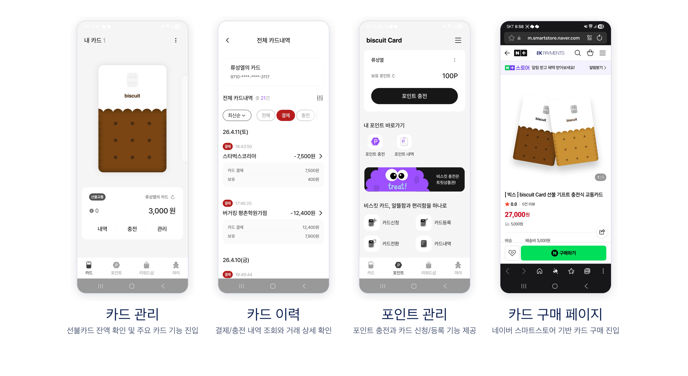
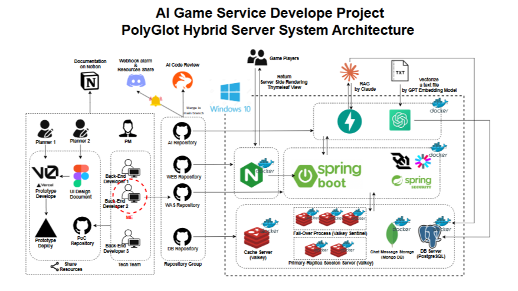
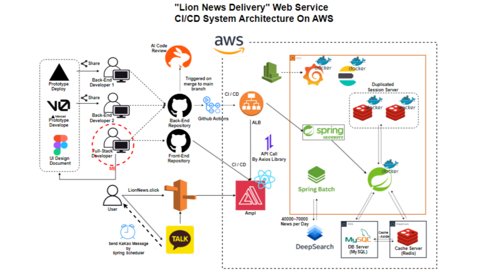
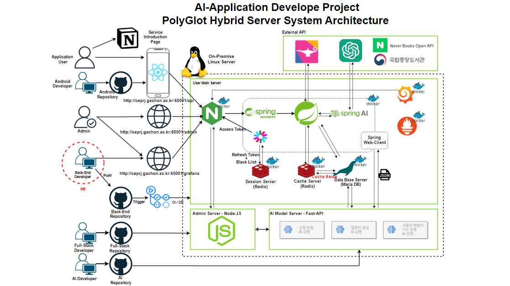
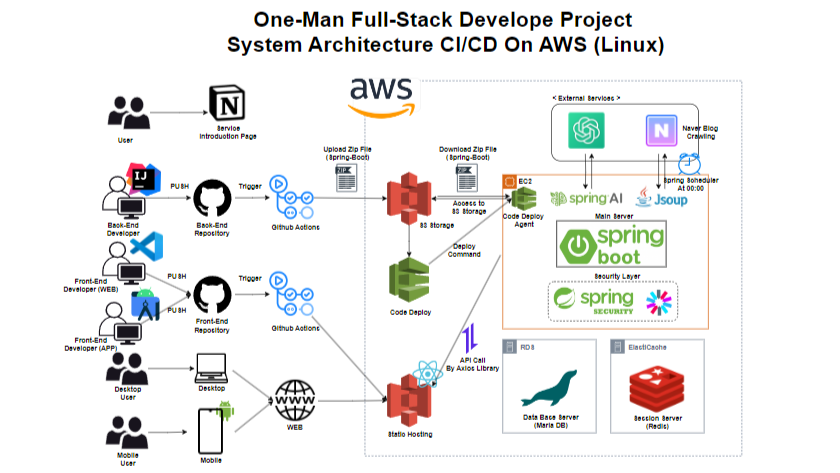

류성열 · Product Engineer @ Sweetbook Co., Ltd. · 2026.08 ~

<h1>핀테크 스타트업 모바일 금융 서비스팀의 백엔드 엔지니어로, 선불카드 앱 출시의 0→1을 경험했습니다</h1>

<table>
  <tr>
    <td align="center" width="33%">
      <h3>35,000명</h3>
      사전 예약자 · Biscuit Card 앱 출시·운영 Bix Payments · 유일한 백엔드 · 2025.12 ~ 2026.06
    </td>
    <td align="center" width="33%">
      <h3>28팀 중 1등</h3>
      가천대 P-project SW 경연 최우수상 AIoT 자동 신고 서비스 · 팀장 · 장학금
    </td>
    <td align="center" width="33%">
      <h3>최우수 프로젝트</h3>
      멋쟁이사자처럼 백엔드 5기 · 6팀 중 1등 RAG 응답 95% 개선 · Cache Hit 68%
    </td>
  </tr>
</table>

   

## 🗓️ Timeline

| 기간 | 소속 | 역할 · 결과 |
|:--|:--|:--|
| 2026.08 ~ | **Sweetbook Co., Ltd.** | Product Engineer · 파트너사용 인쇄공장 연동 API · Demo App |
| 2025.12 ~ 2026.06 | **Bix Payments** · 금융 모바일 서비스 개발팀 | Back-End Engineer · 선불카드 앱 출시 0→1 · 사전 예약 35,000명 |
| 2025.06 ~ 2025.08 | **멋쟁이사자처럼** · 백엔드 단기 심화 5기 | 우수 훈련생 · 1차 프로젝트 팀장 · 최종 프로젝트 최우수상 |
| 2020.03 ~ 2025.08 | **가천대학교** · 컴퓨터공학과 | 학과 AI 프로젝트 3회 연속 팀장 · ALL A+ · 28팀 중 1등 |

## 💼 Experience

<b>🏢 Sweetbook Co., Ltd.</b> · Product Engineer · 2026.08 ~ · 인쇄공장 연동 API · Demo App · AI-First

 

회사가 자체 보유한 **인쇄공장을 파트너사 개발자가 간단히 연동**할 수 있도록, 최적화된 API와 개발자 경험을 높이는 **Demo App**(Test Client)을 C#·TypeScript로 개발하고 있습니다. Claude를 활용해 **PR 기반 AI-First 개발·문서화·테스트 자동화**로 팀원들과 협업합니다.

<b>💳 Bix Payments</b> · Back-End Engineer · 2025.12 ~ 2026.06 · 선불카드 앱 0→1 · 사전 예약 35,000명

 

핀테크 스타트업 B2C 모바일 금융 서비스팀의 **유일한 백엔드 개발자**로, 자사 정산 시스템과 연동되는 카드 시스템 초기 모델과 B2C/B2B 카드 관리 플랫폼을 구축했습니다. 정산·이커머스만 있던 회사의 **신규 사업 확장**과 **선불 사업자 라이선스 취득 조건 충족**에 기여했습니다.

📱 **출시된 앱** &nbsp;  

| 단계 | 한 일 | 결과 |
|:--|:--|:--|
| MVP | Biscuit Card 앱 초기 모델 개발 | 카드 사업 0→1 |
| Alpha | 그룹사 임직원 대상 알파 테스트 | 70명 |
| Launch | 앱 출시·운영 ([Google Play](https://play.google.com/store/apps/details?id=bz.bix.biscuit) · [App Store](https://apps.apple.com/kr/app/biscuit-card/id6758941646)), 관리자 Web 개발·운영 | 사전 예약자 35,000명 |
| Ops | 운영팀과 고객 요구사항 분석 · 장애 대응 · 기술 지원 | 6개월 116 티켓 |
| AI-First | Codex 기반 업무 방식 정착 | 워크플로우 60% 준자동화 |

<b>🦁 멋쟁이사자처럼</b> · 백엔드 단기 심화 5기 · 2025.06 ~ 2025.08 · DungeonTalk 최우수 프로젝트 · News Deliver 팀장

 

<table>
  <tr>
    <td align="center" valign="top" width="50%">
       
      <b>DungeonTalk</b> · PolyGlot Hybrid Server 아키텍처
    </td>
    <td align="center" valign="top" width="50%">
       
      <b>News Deliver</b> · AWS CI/CD 아키텍처
    </td>
  </tr>
</table>

| 프로젝트 | 내용 | 링크 |
|:--|:--|:--|
| **DungeonTalk** 2025.08 · 최종 프로젝트 · 백엔드 개발자 | 🎯 **문제**&emsp;AI와 함께하는 TRPG 플랫폼에서 LLM 할루시네이션으로 응답 품질 저하 🛠️ **한 일** · RAG 시스템 설계·PoC로 할루시네이션 개선 · Valkey 인스턴스 기반 캐싱으로 RAG 응답 속도 개선 · Valkey Sentinel 기반 세션 저장소 장애 자동 대응 구축 · Replay Attack·Brute Force 방어 시스템 구축 · Multi-Repository와 인프라 초기 세팅, PPT 제작·발표 전담 ✅ **결과**&emsp;RAG 응답 95% 개선 · Cache Hit 68% · 최우수 프로젝트 (6팀 중 1등) | [Repo](https://github.com/DungeonTalk/dungeontalk-backend) [Wiki](https://github.com/DungeonTalk/dungeontalk-backend/wiki) [발표](https://youtu.be/I0_8VHwtSKs) |
| **News Deliver** 2025.07 · 1차 프로젝트 · 풀스택 개발자 · 팀장 | 🎯 **문제**&emsp;뉴스 API가 한 번에 1만 건만 반환해 하루 4\~8만 건 수집이 불가, 팀원 40% 조기 이탈 🛠️ **한 일** · Spring Batch·Redis로 매 정각 당일 뉴스 현황을 파악해 선택적 중간 저장 · ElasticSearch로 관심사 기반 뉴스 검색 구현 · Cache-Aside 패턴 Redis 캐싱 적용 · 카카오 로그인·메시지 전송 연동, 프론트엔드(TypeScript·React) 전담 · 범위 축소·역할 재분배로 마감 준수, Beta Test 주도 ✅ **결과**&emsp;하루 4\~8만 건 저장 시스템 안정화 · API 성능 95.76% 개선 · 마감 준수 + Beta Test | [Server](https://github.com/News-Deliver/Server) [Web](https://github.com/News-Deliver/Web) [발표](https://youtu.be/e8M7uNfBp1c) |

<b>🎓 가천대학교</b> · 컴퓨터공학과 · 2020.03 ~ 2025.08 · 학과 AI 프로젝트 3회 팀장 · 28팀 중 1등 · ALL A+

 

학과 AI 앱 개발 프로젝트 3개를 개발자 겸 팀장으로 이끌며, 사회 문제를 해결하는 AI 서비스와 어드민 페이지를 기획·구현·배포했습니다. WBS 기반 일정 관리, Figma 화면 설계, 주 1회 팀 회의와 팀장 보고를 맡았고 세 프로젝트 모두 **A+ 성적**을 받았습니다.

<b>BookCalendar</b> · 온프레미스 PolyGlot Hybrid Server 아키텍처 (Node.js · Spring · FastAPI)

| 프로젝트 | 내용 | 링크 |
|:--|:--|:--|
| **BookCalendar** 2025.03 ~ 06 · 3차 · 백엔드 개발자 · 팀장 | 🎯 **문제**&emsp;10년간 독서율 72%→41% 하락, 독서를 이어가게 하는 AI Daily 독서 서비스 🛠️ **한 일** · 온프레미스 Linux에 Node.js·Spring·FastAPI 폴리글랏 아키텍처와 GitHub Actions CI/CD 구축 · Spring 메인 서버 46개 API 구현, Redis 캐시 서버·세션 서버 분리 구축 · Cache-Aside 패턴으로 핵심 API 10개 성능 개선 · 공용 GPU 과부하 시 Spring AI로 GPT API 폴백, 할루시네이션은 GPT 역할 변경으로 해결 ✅ **결과**&emsp;핵심 API 10개 98.56% 개선 · A+ | [Repo](https://github.com/passionryu/BookCalendarServer) [Notion](https://faint-lavender-bab.notion.site/AI-Vengers-BookCalendar-AI-1d1bc068c52d8087b61fdf9677abf2b9) |
| **Avery · AI Mental Care** 2024.09 ~ 12 · 2차 · 백엔드 개발자 · 팀장 | 🎯 **문제**&emsp;정신질환 평생 유병률 27%, 생성형 AI 기반 개인 맞춤 멘탈케어 🛠️ **한 일** · 온프레미스 Linux에 Spring·FastAPI 폴리글랏 아키텍처와 CI/CD 구축 · Spring AI Beta를 정식 출시 9개월 전에 적용해 GPT 연동 · 4가지 모드 심리상담 챗봇, AI 다이어리(AI 레포트·마음 네컷), 정신질환 자가진단, 관리자 서버 구현 ✅ **결과**&emsp;자가진단 → AI 상담 → AI 감정 정리 플로우 완성 · A+ | [Repo](https://github.com/passionryu/Chat_Bot) |
| **킥라니 구조대** 2023.09 ~ 12 · 1차 · 임베디드 개발자 · 팀장 | 🎯 **문제**&emsp;5년간 1382.9% 증가한 전동킥보드 사고, 골든타임 확보 🛠️ **한 일** · Android(Java)·Raspberry Pi·Firebase Realtime DB를 연동한 AIoT 아키텍처 구축 · 리드 스위치·ADXL345 가속도 센서 모듈로 실시간 데이터 수집 · AI 사고 판단 시 GPS 좌표 기반 119 자동 신고, 수동 취소 지원 · 실제 킥보드에 부착해 테스트 ✅ **결과**&emsp;28팀 중 1등 · 장학금 · A+ | [Repo](https://github.com/passionryu/Automatic-Reporting-App-AIOT-project) |

## 🤖 AI-First Engineering 2026 · 개인 프로젝트

GitHub Issue 하나가 **기획 → 설계 → 개발 → 리뷰 → QA → 문서 → 지식 축적** 7단계를 흐르는 개발 하네스를 설계했습니다. QA는 Playwright, 문서는 Notion, 지식은 Obsidian에 에이전트가 직접 쌓습니다. 이 하네스로 AI 멘탈케어 서비스 **Haru Mind** MVP를 만들어 배포했습니다.

<table>
  <tr>
    <td width="280" valign="top">
      
    </td>
    <td valign="top">
      <b>BehindCon 발표</b> 
      <a href="https://www.youtube.com/watch?v=Po1S4HBXo6w">AI를 쓰지 않으면 뒤처지고, AI에만 의존하면 대체된다</a>
        
      <a href="https://github.com/passionryu/Harness">Harness 레포</a> · <a href="https://github.com/passionryu/myMentalCare">Haru Mind 레포</a> · <a href="https://velog.io/@rsy991225/series/AI-%ED%99%9C%EC%9A%A9-%EA%B3%B5%EB%B6%80">AI 활용 공부 (Velog 시리즈)</a>
    </td>
  </tr>
</table>

<b>Haru Mind 화면</b> · 조언보다는 마음의 정리를 도와주는 AI 챗봇 · Kotlin/Spring Boot · Next.js · Railway

 

## 🔬 Research · 서버 안정성 연구 2025.09 ~ 10 · 개인

비즈니스 로직 없이 **대규모 트래픽과 장애 대응만** 파고든 연구입니다. 실험 20건 이상을 난이도·상태와 함께 기록했고, 실패한 시도(JVM 튜닝으로 오히려 성능 66% 악화)도 그대로 남겼습니다.

- Connection Pooling으로 Latency **724.94ms → 33.28ms (약 21.8배)**
- 중규모 부하 테스트에서 **초당 3,000 req** 처리
- Valkey Sentinel PoC · Primary-Replica 이중화 · Read/Write 트래픽 분기 · 서버 5배 수평 확장
- [연구 기록 (Notion)](https://knotty-toast-80a.notion.site/26b1979809dd800681eff595e8dbe3bd) · [Repo](https://github.com/Research-Project-rsy/High-Traffic-Server)

## 🧩 기타 프로젝트 · 활동

| 활동 | 내용 | 링크 |
|:--|:--|:--|
| **GDG Gachon 해커톤 · 디지털 옷장** 2025.02 · 무박 2일 · 백엔드 개발자 | 🎯 **주제**&emsp;일상의 사소한 불편을 해결하는 서비스 🛠️ **한 일** · 회원 가입·로그인 화면 구현과 서버 연동 · Spring AI로 의상 추천 챗봇·리포트 구현 ✅ **결과**&emsp;장려상 (7팀 중 3등) | [Back](https://github.com/passionryu/3rdwagle-team6-back) [Front](https://github.com/passionryu/3rdwagle-team6-front) |
| **Healing Space** 2025.01 ~ 03 · 개인 프로젝트 · 풀스택 개발자 | 🎯 **주제**&emsp;"디지털 힐링 & 마인드 케어" 웹 서비스 🛠️ **한 일** · AI 다이어리 · AI 고민 상담 · AI 심리 상담 챗봇 · 힐링 커뮤니티를 React/Spring Boot로 구현 · GitHub Actions → AWS 자동 배포 파이프라인 구축 ✅ **결과**&emsp;반응형 웹 서비스 배포 | [Back](https://github.com/passionryu/Healing-Space-Back) [Front](https://github.com/passionryu/Healing-Space-Front) [Notion](https://furtive-bard-509.notion.site/Healing-Space-Web-Service-14c83cc537b6801d92e8ec47ccfab4ab) |
| **KKSC 동아리 홈페이지 · 회원 시스템 개발팀장** 2024 여름 · 2개월 · 22명 5개 팀 | 🎯 **주제**&emsp;백엔드 3팀·프론트 1팀·PM 1팀이 참여한 동아리 홈페이지 개발 🛠️ **한 일** · 회원 시스템 팀(5명) 리드, 협업용 회원 관리 시스템 연구·토론 · Spring Security·Redis 기반 회원 시스템 구축 · 게시판·캘린더 팀과 연동해 서버 파트 완성 | [Repo](https://github.com/passionryu/StudentClub-WebPage) |
| **KKSC Java/Spring 스터디 팀장** 2024 상·하반기 · 각 3개월 | 🛠️ **한 일** · Java·Spring Boot 기초 스터디 팀장 (3개월) · Java·Spring Boot 심화 스터디 팀장 (3개월) · 팀원 관리와 스터디 운영 | |

<b>Healing Space 시스템 아키텍처</b> · AWS CI/CD (Linux)

 

## 🛠️ Tech Stack

<kbd>Java</kbd> <kbd>Kotlin</kbd> <kbd>C#</kbd> <kbd>TypeScript</kbd> <kbd>Spring Boot</kbd> <kbd>Spring Security</kbd> <kbd>JPA · QueryDSL</kbd> <kbd>MariaDB · MySQL</kbd> <kbd>Redis · Valkey</kbd> <kbd>Docker</kbd> <kbd>Nginx</kbd> <kbd>AWS · GCP</kbd>

전체 보기

 

- **Backend** · Java · Kotlin · C# · Spring Boot · Spring Security · Spring Batch · Spring AI · JPA · QueryDSL · FastAPI
- **Data** · MariaDB · MySQL · PostgreSQL · Redis · Valkey (Sentinel) · ElasticSearch
- **Infra** · Docker · Nginx · AWS · Google Cloud · On-Premises Linux · GitHub Actions
- **Observability** · Grafana · Prometheus
- **Frontend** · TypeScript · React · Next.js
- **Architecture · Work** · Hexagonal Architecture · DDD · Claude · Codex · GitHub Kanban · Notion · Obsidian

## 🏆 Awards

| 시기 | 수상 | |
|:--|:--|:--|
| 2025.09 | 멋쟁이사자처럼 최종 프로젝트 **최우수상** | 6팀 중 1등 · DungeonTalk |
| 2025.02 | Google Developer Group Gachon 해커톤 **장려상** | 7팀 중 3등 |
| 2023.12 | 가천대학교 P-project SW 경연대회 **최우수상** | 28팀 중 1등 · 장학금 |
| 2020.12 | 가천대학교 AI SW 페스티벌 **최우수상** | 17팀 중 1등 |

## ✍️ Writing

- [Velog · 310편](https://velog.io/@rsy991225/posts) — 대규모 트래픽 · Valkey Sentinel · AI 하네스 개발 기록
- [클라우드(AWS) 공부 및 적용 기록](https://held-frigate-d9c.notion.site/AWS-19a54503738d80b0b809d12dc46b5083)
- [전공생 PT 기반 CS 스터디](https://github.com/Gachon-CS-Study/CS-Study)

<a href="mailto:rsy1225@naver.com">rsy1225@naver.com</a> · <a href="https://www.linkedin.com/in/%EC%84%B1%EC%97%B4-%EB%A5%98-62880b352/">LinkedIn</a> · <a href="https://velog.io/@rsy991225/posts">Velog</a>

