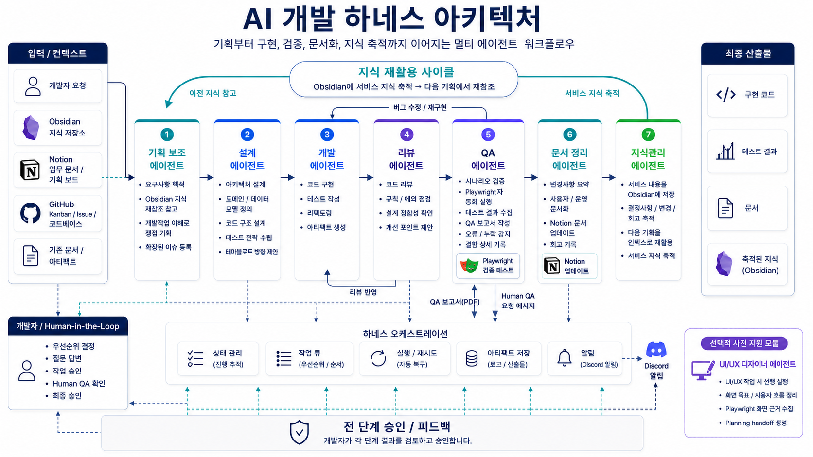
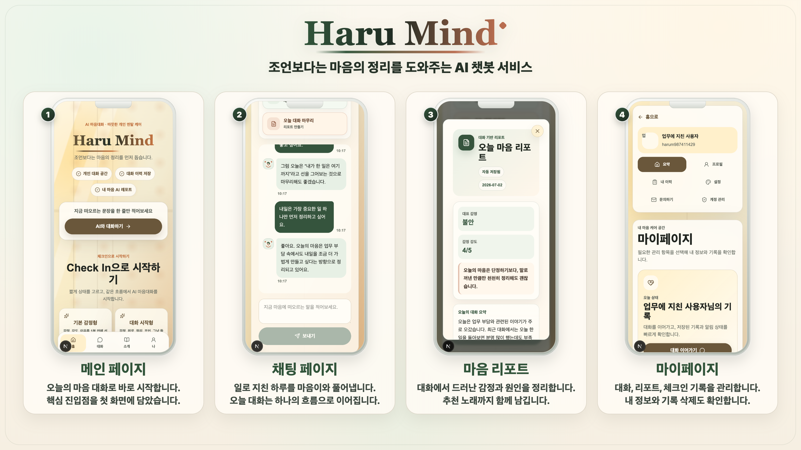

# 류성열 | Backend Developer

치열한 몰입을 통해, 높은 성과(28팀 중 1등, 최우수팀 선정, 신규 서비스 출시·운영 성공)를 도출하는 개발자 류성열입니다. 
학부(AI 서비스 개발 학과 프로젝트, 개발 동아리)->단기 심화 부트캠프(3개월)->핀테크 스타트업(7개월) 경험을 기반으로 동연차 개발자들에 비해 프로젝트 감각이 뛰어납니다.      
핀테크 스타트업에서 "가맹점-카드사-협력사 시스템-카드 시스템-자사 정산 시스템"을 연결하는 B2C 카드 서비스를 초기 개발(MVP)-Alpha Test(그룹사 임직원 70명 대상)-출시·운영(사전 예약 35,000명)을 경험하며 0->1 실무 경험을 보유하고 있습니다. 

특히 AI 기반 업무를 선호하며, 실무에서 Codex 기반으로 개발 Workflow의 60%를 준자동화하며 6개월간 116개 업무 티켓을 처리했습니다.

## History  

| 학부(컴퓨터 공학)                                                                                                                             | 단기 심화 부트캠프 | 실무(Fintech StartUp)                                                                                                                                                                                                                                          |
|----------------------------------------------------------------------------------------------------------------------------------------| --- |--------------------------------------------------------------------------------------------------------------------------------------------------------------------------------------------------------------------------------------------------------------|
| - AI 서비스 개발 학과 프로젝트 팀장(9개월) - 웹/앱 개발 동아리 백엔드 개발팀장/스터디장(1년) - 개발 대회 3회 참여(최우수상 2회, 장려상 1회) - 정보 보안/임베디드 개발 동아리 및 7번의 개발 스터디 참여 | - 백엔드 심화 이론 교육 - 1차 프로젝트 개발 팀장 - 2차 프로젝트 개발자 참여 → 최우수 프로젝트 선정 | - Biscuit Card(카드 기반 서비스) App 초기 MVP 개발 - Biscuit Card(카드 기반 서비스) App Alpha Test 수행(그룹사 임직원 70명 대상) - Biscuit Card(카드 기반 서비스) App 출시·운영(사전 예약자 35,000명 확보) - Biscuit Card(카드 기반 서비스) 관리자 Web 개발 및 운영 - 사내 운영팀과 협업하여 고객 요구사항 분석, 장애 대응 및 기술 지원 수행 |

## 핵심 강점

| 강점               | 근거                                                               |
|------------------|------------------------------------------------------------------|
| **핀테크 서비스 0→1**  | B2C 카드 서비스 MVP 개발 → 70명 Alpha Test → 사전 예약자 35,000명 확보 → 출시 및 운영 |
| **외부 시스템 연동**    | 자사 정산 시스템, 카드 플랫폼 협력사, PG사 API 연동 및 카드 결제 파이프라인 구축               |
| **자사 서비스 운영 경험** | 운영/CS 티켓 기반 CS & 장애 대응, 협력사와 공동 데이터 복구 & 재발 방지 시스템 구축            |
| **AI 기반 업무 자동화** | Codex 기반 기획/설계-구현-QA-배포 과정 60% 준자동화, 6개월간 116개 업무 티켓 처리          |

## Featured Work

| Type | Project | What I Built | Links |
| --- | --- | --- | --- |
| **실무** | **Biscuit Card** | B2C 카드 서비스 App MVP 개발 → 70명 Alpha Test → 사전 예약자 35,000명 확보 후 출시·운영. 관리자 Web과 정산/협력사/PG 연동으로 카드 결제 파이프라인 구축. | [Google Play](https://play.google.com/store/apps/details?id=bz.bix.biscuit&hl=ko) |
| **과제 테스트** | **RooMory** | 커플/가족/학급/동아리가 함께 쓰는 기록방 기반 Full-Stack 서비스. 기록방, 채팅, 추억 게시판, 미션 인증, 편지, 캘린더, 책 만들기/주문 관리까지 구현. | [Repo](https://github.com/passionryu/assignment-test) |
| **개인 프로젝트** | **Haru Mind** | GitHub Kanban 기반 7단계 Workflow와 8개 Multi-Agent 시스템으로 AI 챗봇 MVP를 1주일 만에 배포. 기획/설계-구현-QA-문서화 흐름을 AI로 자동화하는 Harness 구조 검증. | [Service](https://my-mental-careweb-production.up.railway.app/) · [App Repo](https://github.com/passionryu/myMentalCare) · [Harness Repo](https://github.com/passionryu/Harness) |
| **부트캠프** | **DungeonTalk** | WebSocket·RAG 기반 실시간 TRPG 채팅 서비스 개발. RAG 응답 속도 95% 개선, Cache Hit Rate 68% 달성 및 Valkey 기반 Session 장애 자동 대응 시스템 구축. | [Team Repos](https://github.com/orgs/DungeonTalk/repositories) · [Wiki](https://github.com/DungeonTalk/dungeontalk-backend/wiki) · [Presentation](https://youtu.be/I0_8VHwtSKs) |
| **부트캠프** | **멋쟁이 뉴스 배달부** | 하루 4~8만 건 뉴스 데이터를 수집하고, 사용자 관심사 기반 뉴스를 KakaoTalk으로 전송하는 서비스 개발. 팀원 40% 이탈 상황에서 팀장으로 범위/역할을 재정의해 마감 준수 및 Beta Test 수행. | [BE Repo](https://github.com/News-Deliver/Server) · [Web Repo](https://github.com/News-Deliver/Web) · [Presentation](https://youtu.be/e8M7uNfBp1c) |
| **학부 AI 프로젝트** | **Book Calendar** | 독서율 72% → 41% 하락 문제에 주목한 AI 기반 Daily 독서 도우미 서비스. Node.js-Spring-FastAPI Polyglot 구조, 46개 API, Redis 캐싱으로 핵심 API 성능 98.56% 개선. | [BE Repo](https://github.com/passionryu/BookCalendarServer) · [Notion](https://faint-lavender-bab.notion.site/AI-Vengers-BookCalendar-AI-1d1bc068c52d8087b61fdf9677abf2b9?source=copy_link) |
| **학부 AI 프로젝트** | **Avery** | 정신질환 평생 유병률 27% 문제에 주목한 생성형 AI 기반 개인 맞춤형 멘탈 케어 챗봇 서비스. Spring AI 정식 출시 9개월 전 Beta Version을 연구·적용하고, AI 상담/레포트/마음 네컷 기능 구현. | [Repo](https://github.com/passionryu/Chat_Bot) |
| **학부 AI 프로젝트** | **킥라니 구조대** | 전동킥보드 사고 1382.9% 증가 문제를 해결하기 위한 AIoT 자동 신고 서비스. Raspberry Pi 센서 데이터와 Android 앱을 연동해 사고 감지, GPS 기반 119 신고, 수동 취소 플로우 구현. | [Repo](https://github.com/passionryu/Automatic-Reporting-App-AIOT-project) |
| **개인 프로젝트** | **Healing Space** | React/Spring Boot 기반 힐링 공간 공유 웹 서비스 개인 프로젝트. FE/BE를 분리 구현하고 GitHub Actions 기반 AWS 배포까지 수행하며 풀스택 개발 흐름 검증. | [Service](http://healing-space-front.s3-website.ap-northeast-2.amazonaws.com) · [BE Repo](https://github.com/passionryu/Healing-Space-Back) · [FE Repo](https://github.com/passionryu/Healing-Space-Front) · [Notion](https://furtive-bard-509.notion.site/Healing-Space-Web-Service-14c83cc537b6801d92e8ec47ccfab4ab?pvs=4) |
| **해커톤** | **디지털 옷장** | Google Developer Group 해커톤 장려상 수상 서비스. Spring AI 기반 의상 추천 챗봇/레포트와 회원가입·로그인 기능을 구현해 AI 서비스와 인증 기능을 함께 담당. | [BE Repo](https://github.com/passionryu/3rdwagle-team6-back) · [FE Repo](https://github.com/passionryu/3rdwagle-team6-front) |

## Tech Stack

<table>
  <tr>
    <th align="left">Area</th>
    <th align="left">Technologies</th>
  </tr>
  <tr>
    <td><strong>Backend</strong></td>
    <td>
      
      
      
      
      
      
    </td>
  </tr>
  <tr>
    <td><strong>Data</strong></td>
    <td>
      
      
      
      
    </td>
  </tr>
  <tr>
    <td><strong>Architecture</strong></td>
    <td>
      
      
    </td>
  </tr>
  <tr>
    <td><strong>Infra</strong></td>
    <td>
      
      
      
      
      
    </td>
  </tr>
  <tr>
    <td><strong>Observability</strong></td>
    <td>
      
      
    </td>
  </tr>
  <tr>
    <td><strong>Tools</strong></td>
    <td>
      
      
      
      
    </td>
  </tr>
</table>

<strong>AI Harness Architecture & Haru Mind Screens</strong>

<table>
  <tr>
    <td align="center"><strong>AI Harness Architecture</strong> </td>
    <td align="center"><strong>Haru Mind MVP</strong> </td>
  </tr>
</table>

> BehindCon 발표: <a href="https://www.youtube.com/watch?v=Po1S4HBXo6w" target="_blank" rel="noopener noreferrer">AI를 쓰지 않으면 뒤처지고, AI에만 의존하면 대체된다</a>

---

<strong>System Architecture Portfolio</strong>

<table>
  <tr>
    <td align="center" valign="top" width="50%">
       
      <b>Healing Space</b> 
      <a href="https://furtive-bard-509.notion.site/Healing-Space-Web-Service-14c83cc537b6801d92e8ec47ccfab4ab?pvs=4">Notion Page</a>
    </td>
    <td align="center" valign="top" width="50%">
       
      <b>Book Calendar</b> 
      <a href="https://faint-lavender-bab.notion.site/AI-Vengers-BookCalendar-AI-1d1bc068c52d8087b61fdf9677abf2b9?source=copy_link">Notion Page</a>
    </td>
  </tr>
  <tr>
    <td align="center" valign="top" width="50%">
       
      <b>News Deliver</b> 
      <a href="https://github.com/News-Deliver/Server">GitHub Repository</a>
    </td>
    <td align="center" valign="top" width="50%">
       
      <b>DungeonTalk</b> 
      <a href="https://github.com/DungeonTalk/dungeontalk-backend">GitHub Repository</a>
    </td>
  </tr>
</table>

<strong>Projects</strong>

<strong>멋쟁이 사자처럼 최종 프로젝트: DungeonTalk (2025.08.06 ~ 2025.08.26)</strong>

1명의 PM, 2명의 기획자, 3명의 백엔드 개발자(Spring Boot)가 참여한 프로젝트입니다. 
PoC, 백엔드 개발, 개발 문서 정리 및 서비스 발표를 통해 팀의 최우수상 수상에 기여했습니다.

- [Team Repositories](https://github.com/orgs/DungeonTalk/repositories)
- [Wiki](https://github.com/DungeonTalk/dungeontalk-backend/wiki)
- [Presentation](https://youtu.be/I0_8VHwtSKs)

<strong>멋쟁이 사자처럼 1차 프로젝트: News Deliver (2025.07.07 ~ 2025.07.27)</strong>

3명의 백엔드 개발자(Spring Boot)가 참여한 프로젝트입니다. 
팀장, 화면 설계서·프로토타입 제작, Web 개발, 백엔드 개발 및 서비스 발표를 담당했습니다.

- [Web Repository](https://github.com/News-Deliver/Web)
- [Backend Repository](https://github.com/News-Deliver/Server)
- [Presentation](https://youtu.be/e8M7uNfBp1c)
- [Prototype](https://merry-crepe-479d93.netlify.app/)
- [Figma](https://www.figma.com/design/b742hXQtI8IqTM3iyirWzR/Untitled?node-id=0-1&p=f&t=BDVVaoSPTOQTkpMc-0)

<strong>학과 AI 애플리케이션 3차 프로젝트: Book Calendar (2025.03.01 ~ 2025.06.08)</strong>

2명의 AI 개발자, 안드로이드 개발자, 풀스택 개발자(Node.js), 백엔드 개발자(Spring Boot)가 참여한 프로젝트입니다. 
팀장, 화면 설계서 제작, 문서화, 백엔드 개발 및 서비스 발표를 담당해 프로젝트 성적 A+ 취득에 기여했습니다.

- [Notion](https://faint-lavender-bab.notion.site/AI-Vengers-BookCalendar-AI-1d1bc068c52d8087b61fdf9677abf2b9?source=copy_link)
- [Figma](https://www.figma.com/design/ndspvub92U64eh9J2MDZSV/Untitled?node-id=0-1&p=f&t=kKi8mY0w6a20eyZM-0)
- [Backend Repository](https://github.com/passionryu/BookCalendarServer)

<strong>Google Developer Group 해커톤 (2025.02.21 ~ 2025.02.22)</strong>

기획자, 2명의 웹 개발자, 2명의 백엔드 개발자(Spring Boot)가 참여한 프로젝트입니다. 
백엔드 개발 및 Web 개발로 팀의 장려상 수상에 기여했습니다.

- [Backend Repository](https://github.com/passionryu/3rdwagle-team6-back)
- [Frontend Repository](https://github.com/passionryu/3rdwagle-team6-front)

<strong>Healing Space 개인 프로젝트 (2025.01.01 ~ 2025.03.01)</strong>

React/Spring Boot 기반 웹 서비스를 개발하고 GitHub Actions로 AWS에 배포했습니다.

- [Backend Repository](https://github.com/passionryu/Healing-Space-Back)
- [Frontend Repository](https://github.com/passionryu/Healing-Space-Front)
- [Service](http://healing-space-front.s3-website.ap-northeast-2.amazonaws.com)
- [Notion](https://furtive-bard-509.notion.site/Healing-Space-Web-Service-14c83cc537b6801d92e8ec47ccfab4ab?pvs=4)

<strong>학과 AI 애플리케이션 2차 프로젝트: AI Mental Care (2024.09.05 ~ 2024.11.07)</strong>

2명의 AI 개발자, 안드로이드 개발자, 백엔드 개발자(Spring Boot)가 참여한 프로젝트입니다. 
팀장, 화면 설계서 제작, 문서화, 백엔드 개발 및 서비스 발표를 담당해 프로젝트 성적 A+ 취득에 기여했습니다.

- [Repository](https://github.com/passionryu/Chat_Bot)
- [Figma](https://www.figma.com/design/N4NhMHsOaF8D7UD4v5BB2k/Untitled?t=kKi8mY0w6a20eyZM-0)

<strong>개발 동아리 자체 홈페이지 개발 프로젝트 (2024.06.20 ~ 2024.08.30)</strong>

총 22명, 5개 개발팀이 참여한 프로젝트입니다. 
BE 1팀(회원 관리 시스템 개발팀) 팀장으로 팀 내·외부 기능 요구사항을 조율했습니다.

- [Backend Repository](https://github.com/passionryu/StudentClub-WebPage)

<strong>학과 AI 애플리케이션 1차 프로젝트: AIoT Automatic Reporting App (2023.09.01 ~ 2023.12.21)</strong>

AI 개발자, 안드로이드 개발자, 2명의 IoT 개발자가 참여한 프로젝트입니다. 
팀장, 문서화, IoT 개발 및 서비스 발표를 담당해 프로젝트 성적 A+와 28개 팀 중 최우수상 수상에 기여했습니다.

- [Repository](https://github.com/passionryu/Automatic-Reporting-App-AIOT-project)

<strong>Study Records</strong>

- [300편 이상 작성한 Velog 개발 블로그](https://velog.io/@rsy991225/posts)
- [대규모 트래픽 개인 연구 프로젝트 기록](https://knotty-toast-80a.notion.site/26b1979809dd800681eff595e8dbe3bd?source=copy_link)
- [AWS 공부 기록](https://held-frigate-d9c.notion.site/AWS-19a54503738d80b0b809d12dc46b5083?source=copy_link)
- [전공생들과 함께 한 PT 기반 CS 스터디 기록](https://github.com/Gachon-CS-Study/CS-Study)

<strong>Presentations</strong>

- [AI를 쓰지 않으면 뒤처지고, AI에만 의존하면 대체된다](https://www.youtube.com/watch?v=Po1S4HBXo6w&t=1324s)
- [RAG 기반 게임 서비스 발표회](https://youtu.be/I0_8VHwtSKs)
- [카카오톡 기반 뉴스 전송 웹 서비스 발표 영상](https://youtu.be/e8M7uNfBp1c)

<strong>Awards</strong>

- 멋쟁이 사자처럼 최우수상 수상 (6팀 중 1등)
- Google Developer Group Gachon 해커톤 장려상 수상 (7팀 중 3등)
- 가천대학교 P-project SW 경연 대회 최우수상 수상 (28팀 중 1등)
- 가천대학교 AI SW 페스티벌 최우수상 (17팀 중 1등)

