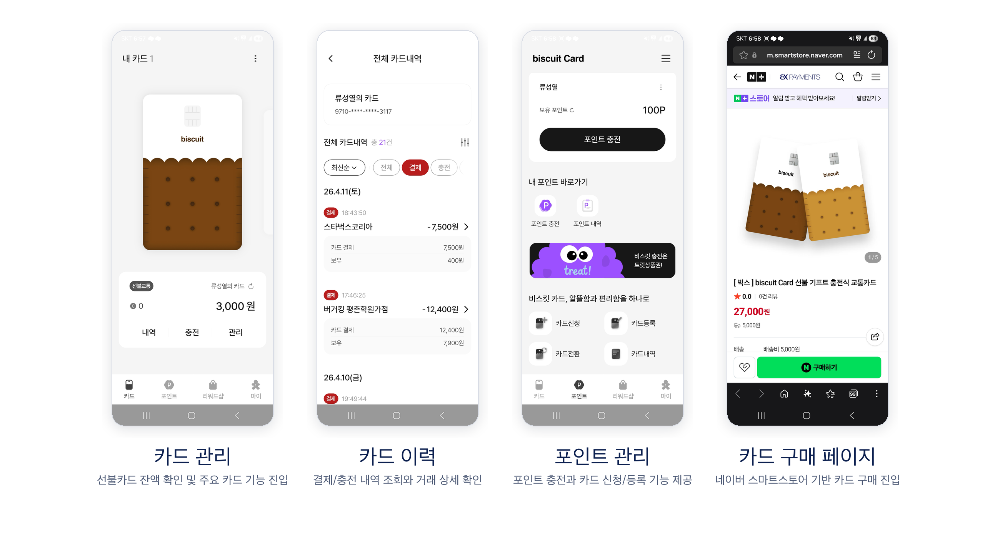
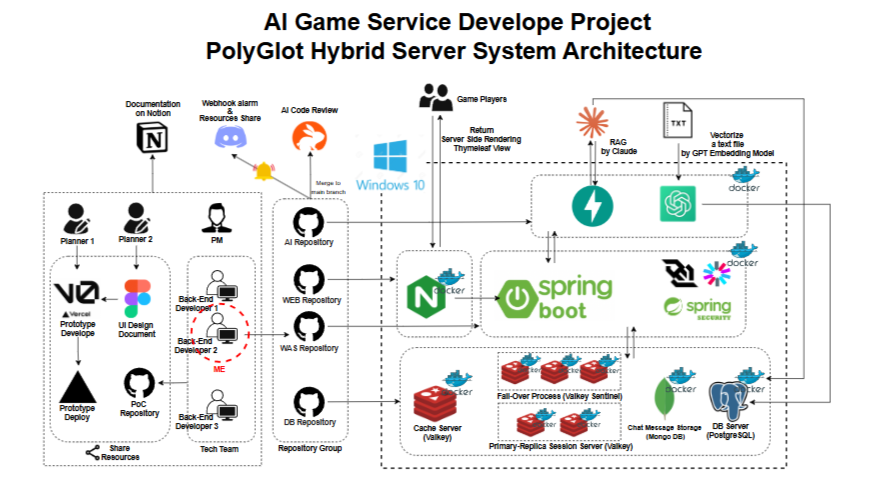
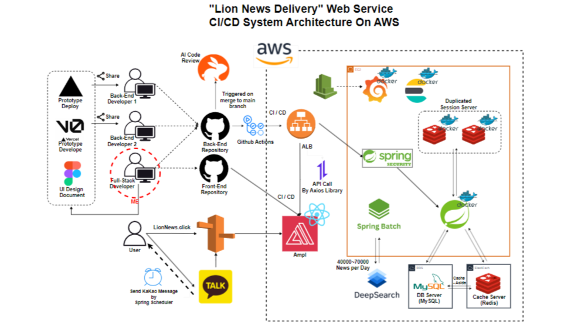
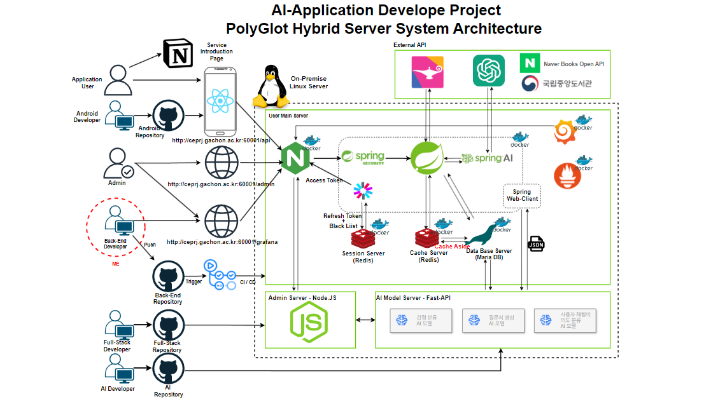
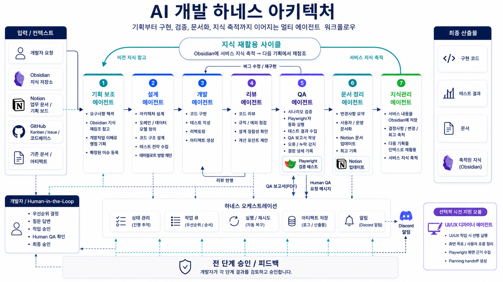
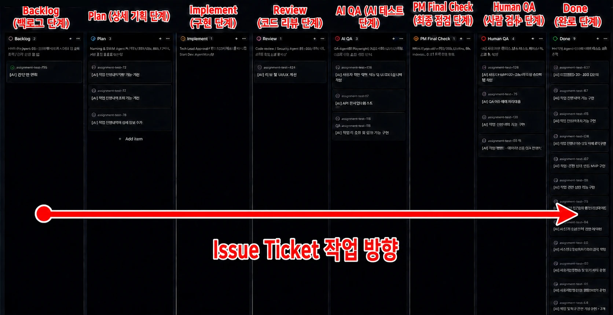
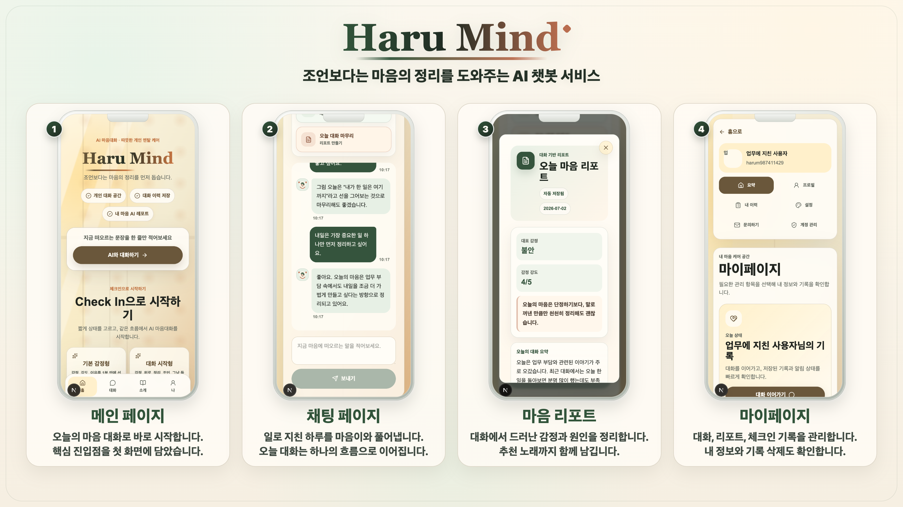
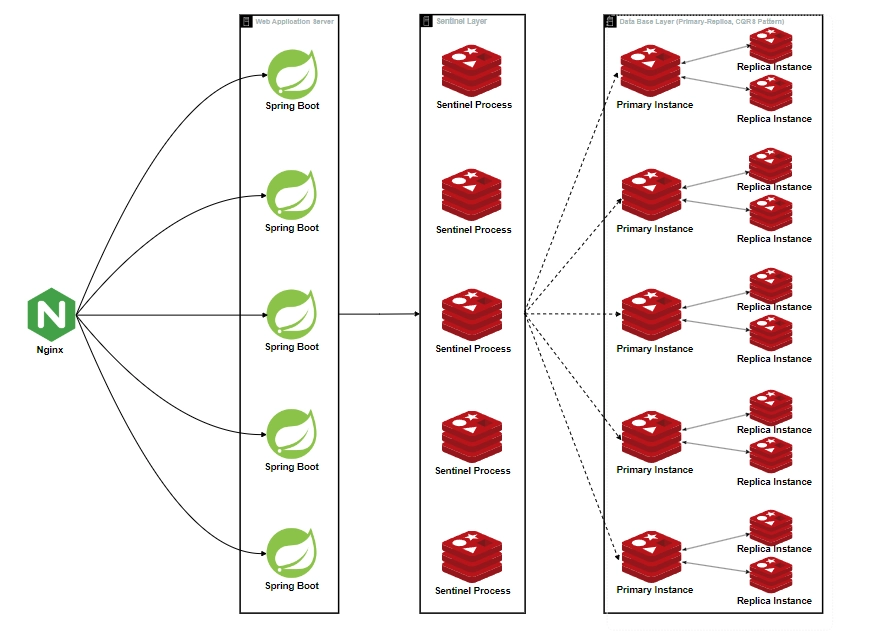
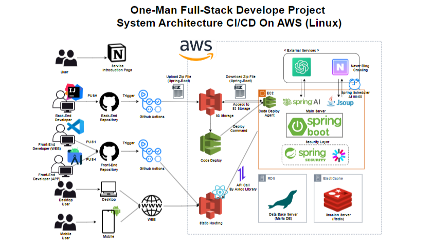

류성열 · Product Engineer @ Sweetbook Co., Ltd. · 2026.08 ~

<h1>"0→1을 만들어 봤고, 지금은 1을 오래 살리는 법을 익힙니다"</h1>

<b>Bix Payments</b> · 핀테크 스타트업에서 MVP~Alpha 기간 유일한 백엔드로 선불카드 앱을 2개월 만에 MVP로 만들고 출시·운영했습니다. <b>Sweetbook</b> · 지금은 포토북·인쇄 커머스의 이미 돌아가는 서비스 위에서 파트너 API 연동 데모, 레거시 서비스 전환, AI-First 개발 환경을 맡고 있습니다.

<table>
  <tr>
    <td align="center" width="33%">
      <h3>MVP 2개월</h3>
      선불카드 앱 0→1 · 알파 테스트 70명 → 출시 Bix Payments · MVP~Alpha 유일한 백엔드
    </td>
    <td align="center" width="33%">
      <h3>결제 정합성 CS 0건</h3>
      운영 4개월 · 카드 결제 외부 원장 기준(SoT) + 멱등 처리
    </td>
    <td align="center" width="33%">
      <h3>충전 10 → 4 클릭</h3>
      알파 테스터 피드백 → 간편결제 연동 포인트 충전 클릭 수 약 60% 감소
    </td>
  </tr>
</table>

   

<h2 align="center"><code>SECTION 01</code> 🗓️ Timeline</h2>

**Work**

| 기간 | 소속 | 역할 · 결과 |
|:--|:--|:--|
| 2026.08 ~ | **Sweetbook Co., Ltd.** · 개발팀 | Product Engineer · 파트너 API 연동 데모 · 레거시 서비스 전환 · AI-First 개발 환경 |
| 2025.12 ~ 2026.06 | **Bix Payments Co., Ltd.** · 금융 모바일 서비스 개발팀 | Back-End Engineer · 선불카드 앱 0→1 출시·운영 · 결제 정합성 CS 0건 |

**Education**

| 기간 | 소속 | 역할 · 결과 |
|:--|:--|:--|
| 2025.06 ~ 2025.08 | **멋쟁이사자처럼** · 백엔드 단기 심화 5기 | 우수 훈련생 · 1차 프로젝트 팀장 · 최종 프로젝트 최우수상 |
| 2020.03 ~ 2025.08 | **가천대학교** · 컴퓨터공학과 | 학과 AI 프로젝트 3회 연속 팀장 · ALL A+ · 28팀 중 1등 |

<h2 align="center"><code>SECTION 02</code> 💼 Experience</h2>

<b>🏢 Sweetbook Co., Ltd.</b> · Product Engineer · 2026.08 ~ · 파트너 API 연동 데모 · 레거시 서비스 전환 · AI-First 개발 환경

 

포토북·인쇄 커머스 회사에서 **자사 서비스 – 중앙 서버(C#/.NET) – 데이터 서버**로 이어지는 구조 위에서, 이미 돌아가는 제품을 멈추지 않고 고치고 넓히는 일을 합니다. 자체 인쇄공장을 **파트너사 개발자가 쉽게 연동**하도록 돕는 일이 중심입니다.

| 일 | 한 일 | 결과 |
|:--|:--|:--|
| **파트너용 API 연동 데모** TypeScript CLI · 진행 중 | · 파트너 개발자가 명령 몇 개로 샘플 주문까지 가 볼 수 있는 Test Client 개발 · 문서만 믿지 않고 sandbox를 직접 호출해 문서와 다른 서버 동작을 확인하고 코드로 처리 · 멱등 키·재시도, AI 코드 리뷰 · 보안 스캔 · 무맥락 클론 테스트로 검증 | 파트너 DX용 레퍼런스 데모 |
| **공개 API SDK 구조 분석** Python · Node.js · Java SDK · OpenAPI | · 파트너용 SDK 3종을 같은 질문 틀로 비교하고 OpenAPI 스펙을 sandbox로 실측 | "PDF 업로드 → 주문" 흐름 결함 발견·보고, 스펙 정정 |
| **레거시 서비스 전환** .NET Framework · WPF · SQL Server | · 레거시 달력 테마 전환 1단계 분석을 코드 · 운영 데이터 · 실측 세 갈래로 교차 검증 | 옮길 범위를 크게 줄이고 1단계 리뷰 승인·머지 |
| **AI-First 개발 환경** Claude Code | · 권한 규칙 · 서브에이전트 · 스킬 · 메모리로 개인 개발 하네스 구성, 업무 기록 자동화 · 공용 레포와 회사 정보를 건드리지 않도록 개인 설정을 분리 | 공용 레포 변경 없이 개인 하네스로 매일 사용 |
| **서버 간 인증 체계 전환** C# · .NET | · 팀장 기획에 따라 통합 인증 체계의 세부 설계·구현을 맡아 단계적으로 운영 반영 | 운영 중 기존 서비스 영향 0곳 |

<b>💳 Bix Payments Co., Ltd.</b> · Back-End Engineer · 2025.12 ~ 2026.06 · 선불카드 앱 0→1 · 결제 정합성 CS 0건 · TCC 보상 트랜잭션

 

핀테크 스타트업 B2C 모바일 금융 서비스팀(7명)에서 **MVP~Alpha 기간 유일한 백엔드 개발자**로, 자사 정산 시스템과 연동되는 카드 시스템 초기 모델과 B2C/B2B 카드 관리 플랫폼을 구축했습니다. 정산·이커머스만 있던 회사의 **신규 사업 확장**과 **선불 사업자 라이선스 취득 조건 충족**에 기여했습니다.

<kbd>Kotlin</kbd> <kbd>Spring Boot</kbd> <kbd>JPA · QueryDSL</kbd> <kbd>Redis</kbd> <kbd>FCM</kbd> <kbd>Hexagonal 멀티모듈</kbd>

📱 **출시된 앱** &nbsp;  

| 단계 | 한 일 | 결과 |
|:--|:--|:--|
| MVP | 결제 · 충전 · 카드 이력 · 잔액 API와 외부 카드 플랫폼 · 자사 정산 시스템 연동 | 2개월 만에 카드 사업 0→1 |
| Alpha | 그룹사 임직원 대상 알파 테스트, 피드백을 받아 간편결제 충전 도입 | 70명 |
| Launch | 앱 출시·운영 ([Google Play](https://play.google.com/store/apps/details?id=bz.bix.biscuit) · [App Store](https://apps.apple.com/kr/app/biscuit-card/id6758941646)), 관리자 Web 개발·운영 | 양대 마켓 출시 |
| Ops | 4개 유관 조직과 고객 요구사항 분석 · 장애 대응 · 기술 지원 | 6개월 116 티켓 |
| AI-First | 설계 검토 · 구현 보조 · QA 요청 정리 · 문서화를 Codex로 처리하고, 구현 전 Sequence Diagram · Flow Chart · Pseudo Code를 스펙으로 고정해 직접 검증·승인 | 워크플로우 약 60% 준자동화 |

| 문제 | 한 일 | 결과 |
|:--|:--|:--|
| **결제 정합성** 협력사 결제 통보의 중복·지연·누락 가능성 | 외부 협력사 원장을 결제 데이터의 기준(SoT)으로 정하고, `카드 식별자 + 승인번호` 멱등 처리와 "의심 통보만 외부 원장 조회"하는 정합화를 MVP 중반에 설계 | 운영 4개월 결제 정합성 CS 0건 |
| **충전 부분 실패** 1차 QA에서 정산금 차감·포인트 충전 중 한쪽만 반영 | 정산 시스템 개발자와 충전 흐름을 Try-Confirm-Cancel · 단계별 상태 기록 · 보상 트랜잭션으로 당일 밤 재구현 | 다음 날 그룹사 임원 데모, 출시 일정 지연 0 · 이후 부분 실패 0건 |
| **결제 장애** 협력사의 미통보 API 스펙 변경 | 팀장과 로그 · 배포 이력으로 원인을 인증 필터 구간까지 좁혀 HotFix, 다음 날 협력사와 DB 대사 | 1시간 내 정상화 · 누락 결제 15건 전부 복구 · 최대 5회 자동 재통보 구현 |
| **충전 UX** 충전마다 외부 결제창 이동 | 간편결제(결제수단 1회 등록 → PIN 인증 → 서버 승인)를 서버 단독 구현, 카드 번호 대신 PG 토큰만 저장 | 충전 클릭 약 10회 → 4회 |
| **테스트 환경** 정산 시스템 DEV/STAGE 전환마다 설정 수정·재배포 | DB 기반 Endpoint 동적 라우팅으로 외부 연동 대상을 런타임에 전환 | 세팅 약 10분 → 1분 이내 |

<b>🦁 멋쟁이사자처럼</b> · 백엔드 단기 심화 5기 · 2025.06 ~ 2025.08 · DungeonTalk 최우수 프로젝트 · News Deliver 팀장

 

<table>
  <tr>
    <td align="center" valign="top" width="50%">
       
      <b>DungeonTalk</b> · PolyGlot Hybrid Server 아키텍처 · Primary-Replica 세션 서버와 Fail-Over 담당
    </td>
    <td align="center" valign="top" width="50%">
       
      <b>News Deliver</b> · AWS CI/CD 아키텍처
    </td>
  </tr>
</table>

| 프로젝트 | 내용 | 링크 |
|:--|:--|:--|
| **DungeonTalk** 2025.08 · 최종 프로젝트 · 백엔드 개발자 | 🎯 **문제** &emsp;AI와 함께하는 TRPG 플랫폼에서 LLM 할루시네이션으로 응답 품질 저하 🛠️ **한 일** &emsp;· 모델 훈련 없이 적용할 수 있는 RAG를 제안하고 PoC로 할루시네이션 개선 검증 &emsp;· Valkey Session/Cache 저장소 분리 &emsp;· **Primary-Replica 구조의 Valkey 세션 저장소 설계·담당**, Sentinel 3개로 장애 자동 대응 구축 &emsp;· Multi-Repository와 인프라 초기 세팅, PPT 제작·발표 전담 ✅ **결과** &emsp;최우수 프로젝트 (6팀 중 1등) · 개발자 개입 없는 세션 서버 자동 Failover | [Repo](https://github.com/DungeonTalk/dungeontalk-backend) [Wiki](https://github.com/DungeonTalk/dungeontalk-backend/wiki) [발표](https://youtu.be/I0_8VHwtSKs) |
| **News Deliver** 2025.07 · 1차 프로젝트 · 풀스택 개발자 · 팀장 | 🎯 **문제** &emsp;뉴스 API가 한 번에 1만 건만 반환해 하루 4\~8만 건 수집이 불가, 팀원 40% 조기 이탈 🛠️ **한 일** &emsp;· 실시간 뉴스 발행 수를 모니터링해 임계치에 닿으면 즉시 Batch를 실행하는 흐름 구축 (Spring Batch·Redis) &emsp;· ElasticSearch로 관심사 기반 뉴스 검색 구현 &emsp;· 카카오 로그인·메시지 전송 연동, 프론트엔드(TypeScript·React) 전담 &emsp;· 팀 해체 제안에도 범위를 MVP로 줄이고 역할 재분배, 이탈자 코드 리팩터링 (Service 400줄 → 120줄) ✅ **결과** &emsp;하루 4\~8만 건 적재 · 1주 Beta Test 데이터 유실률 0% · 마감 1주 전 배포 | [Server](https://github.com/News-Deliver/Server) [Web](https://github.com/News-Deliver/Web) [발표](https://youtu.be/e8M7uNfBp1c) |

<b>🎓 가천대학교</b> · 컴퓨터공학과 · 2020.03 ~ 2025.08 · 학과 AI 프로젝트 3회 팀장 · 28팀 중 1등 · ALL A+

 

학과 AI 앱 개발 프로젝트 3개를 개발자 겸 팀장으로 이끌며, 사회 문제를 해결하는 AI 서비스와 어드민 페이지를 기획·구현·배포했습니다. WBS 기반 일정 관리, Figma 화면 설계, 주 1회 팀 회의와 팀장 보고를 맡았고 세 프로젝트 모두 **A+ 성적**을 받았습니다.

<b>BookCalendar</b> · 온프레미스 PolyGlot Hybrid Server 아키텍처 (Node.js · Spring · FastAPI)

| 프로젝트 | 내용 | 링크 |
|:--|:--|:--|
| **BookCalendar** 2025.03 ~ 06 · 3차 · 백엔드 개발자 · 팀장 | 🎯 **문제** &emsp;10년간 독서율 72%→41% 하락, 독서를 이어가게 하는 AI Daily 독서 서비스 🛠️ **한 일** &emsp;· 온프레미스 Linux에 Node.js·Spring·FastAPI 폴리글랏 아키텍처와 GitHub Actions CI/CD 구축 &emsp;· Spring 메인 서버 46개 API 구현, Redis 캐시 서버·세션 서버 분리 구축 &emsp;· Cache-Aside 패턴으로 핵심 API 10개 성능 개선 &emsp;· 공용 GPU 과부하 시 Spring AI로 GPT API 폴백, 할루시네이션은 GPT 역할 변경으로 해결 ✅ **결과** &emsp;핵심 API 10개 98.56% 개선 · A+ | [Repo](https://github.com/passionryu/BookCalendarServer) [Notion](https://faint-lavender-bab.notion.site/AI-Vengers-BookCalendar-AI-1d1bc068c52d8087b61fdf9677abf2b9) |
| **Avery · AI Mental Care** 2024.09 ~ 12 · 2차 · 백엔드 개발자 · 팀장 | 🎯 **문제** &emsp;정신질환 평생 유병률 27%, 생성형 AI 기반 개인 맞춤 멘탈케어 🛠️ **한 일** &emsp;· 온프레미스 Linux에 Spring·FastAPI 폴리글랏 아키텍처와 CI/CD 구축 &emsp;· Spring AI Beta를 정식 출시 9개월 전에 적용해 GPT 연동 &emsp;· 4가지 모드 심리상담 챗봇, AI 다이어리(AI 레포트·마음 네컷), 정신질환 자가진단, 관리자 서버 구현 ✅ **결과** &emsp;자가진단 → AI 상담 → AI 감정 정리 플로우 완성 · A+ | [Repo](https://github.com/passionryu/Chat_Bot) |
| **킥라니 구조대** 2023.09 ~ 12 · 1차 · 임베디드 개발자 · 팀장 | 🎯 **문제** &emsp;5년간 1382.9% 증가한 전동킥보드 사고, 골든타임 확보 🛠️ **한 일** &emsp;· Android(Java)·Raspberry Pi·Firebase Realtime DB를 연동한 AIoT 아키텍처 구축 &emsp;· 리드 스위치·ADXL345 가속도 센서 모듈로 실시간 데이터 수집 &emsp;· AI 사고 판단 시 GPS 좌표 기반 119 자동 신고, 수동 취소 지원 &emsp;· 실제 킥보드에 부착해 테스트 ✅ **결과** &emsp;28팀 중 1등 · 장학금 · A+ | [Repo](https://github.com/passionryu/Automatic-Reporting-App-AIOT-project) |

<h2 align="center"><code>SECTION 03</code> 🤖 AI-First Engineering 2026 · 개인 프로젝트</h2>

GitHub Issue 하나가 **기획 → 설계 → 개발 → 리뷰 → QA → 문서 → 지식 축적** 7단계를 흐르는 개발 하네스를 설계했습니다. QA는 Playwright, 문서는 Notion, 지식은 Obsidian에 에이전트가 직접 쌓습니다. 이 하네스로 AI 멘탈케어 서비스 **Haru Mind** MVP를 만들어 배포했습니다.

<table>
  <tr>
    <td align="center" valign="top" width="50%">
       
      <b>AI 개발 하네스 아키텍처</b> · 기획부터 지식 축적까지 7개 에이전트 워크플로우 · <a href="https://github.com/passionryu/Harness">Harness 레포</a>
    </td>
    <td align="center" valign="top" width="50%">
       
      <b>GitHub Kanban 작업판</b> · Issue 티켓이 Backlog → Plan → Implement → Review → AI QA → PM Final Check → Human QA → Done으로 흐름
    </td>
  </tr>
</table>

<table>
  <tr>
    <td width="280" valign="top">
      
    </td>
    <td valign="top">
      <b>🎤 BehindCon 발표</b> 
      <a href="https://www.youtube.com/watch?v=Po1S4HBXo6w">AI를 쓰지 않으면 뒤처지고, AI에만 의존하면 대체된다</a> 
      명지대학교 학우들의 초청으로 현직 주니어 개발자의 실무 경험을 공유하고, 다른 현직자들과 네트워킹한 자리입니다.
        
      <a href="https://www.youtube.com/watch?v=Po1S4HBXo6w">발표 영상</a> · <a href="https://velog.io/@rsy991225/series/AI-%ED%99%9C%EC%9A%A9-%EA%B3%B5%EB%B6%80">AI 활용 공부 (Velog 시리즈)</a>
    </td>
  </tr>
  <tr>
    <td width="280" valign="top">
      
    </td>
    <td valign="top">
      <b>🌿 Haru Mind</b> · 조언보다는 마음의 정리를 도와주는 AI 챗봇 
      AI 개발 하네스를 직접 구축해 보고, 그 하네스로 만든 MVP를 경량 클라우드(Railway)에 1주일 만에 출시해 본 개인 프로젝트입니다.
        
      <kbd>Kotlin</kbd> <kbd>Spring Boot</kbd> <kbd>Next.js</kbd> <kbd>MariaDB</kbd> <kbd>Redis</kbd> <kbd>Railway</kbd>
        
      <a href="https://github.com/passionryu/myMentalCare">Haru Mind 레포</a> · <a href="img_4.png">화면 크게 보기</a>
    </td>
  </tr>
</table>

<h2 align="center"><code>SECTION 04</code> 🗂️ Etc</h2>

<b>🔬 Research · 서버 안정성 연구</b> · 2025.09 ~ 10 · 개인 · DungeonTalk 세션 서버의 한계에서 출발 · Latency 724.94ms → 33.28ms · 초당 3,000 req

 

DungeonTalk에서 제가 설계한 세션 저장소는 **Primary-Replica 구조로 장애 대응**을 의도했지만, 대규모 트래픽에서는 결국 함께 무너지는 패턴이었습니다. 이 한계를 직접 느끼고, 비즈니스 로직 없이 **대규모 트래픽을 버티는 서버 구조만** 혼자 연구했습니다.

<table>
  <tr>
    <td align="center" valign="top" width="50%">
       
      <b>Before · DungeonTalk</b> · 제가 담당한 Primary-Replica 세션 서버 + Fail-Over(Valkey Sentinel). 장애 대응은 되지만 대규모 트래픽에서는 함께 다운
    </td>
    <td align="center" valign="top" width="50%">
       
      <b>After · 연구 프로젝트</b> · Nginx 로드밸런싱 → WAS 5배 수평 확장 → Sentinel 레이어 → Primary-Replica 데이터 레이어(CQRS)
    </td>
  </tr>
</table>

실험 20건 이상을 난이도·상태와 함께 기록했고, 실패한 시도(JVM 튜닝으로 오히려 성능 66% 악화)도 그대로 남겼습니다.

- Connection Pooling으로 Latency **724.94ms → 33.28ms (약 21.8배)**
- 중규모 부하 테스트에서 **초당 3,000 req** 처리
- Valkey Sentinel PoC · Primary-Replica 이중화 · Read/Write 트래픽 분기 · 서버 5배 수평 확장
- [연구 기록 (Notion)](https://knotty-toast-80a.notion.site/26b1979809dd800681eff595e8dbe3bd) · [Repo](https://github.com/Research-Project-rsy/High-Traffic-Server)

<b>🧩 기타 프로젝트 · 활동</b> · GDG 해커톤 장려상 · Healing Space · KKSC 회원 시스템 개발팀장 · 스터디 팀장

 

| 활동 | 내용 | 링크 |
|:--|:--|:--|
| **GDG Gachon 해커톤 · 디지털 옷장** 2025.02 · 무박 2일 · 백엔드 개발자 | 🎯 **주제** &emsp;일상의 사소한 불편을 해결하는 서비스 🛠️ **한 일** &emsp;· 회원 가입·로그인 화면 구현과 서버 연동 &emsp;· Spring AI로 의상 추천 챗봇·리포트 구현 ✅ **결과** &emsp;장려상 (7팀 중 3등) | [Back](https://github.com/passionryu/3rdwagle-team6-back) [Front](https://github.com/passionryu/3rdwagle-team6-front) |
| **Healing Space** 2025.01 ~ 03 · 개인 프로젝트 · 풀스택 개발자 | 🎯 **주제** &emsp;"디지털 힐링 & 마인드 케어" 웹 서비스 🛠️ **한 일** &emsp;· AI 다이어리 · AI 고민 상담 · AI 심리 상담 챗봇 · 힐링 커뮤니티를 React/Spring Boot로 구현 &emsp;· GitHub Actions → AWS 자동 배포 파이프라인 구축 ✅ **결과** &emsp;반응형 웹 서비스 배포 | [Back](https://github.com/passionryu/Healing-Space-Back) [Front](https://github.com/passionryu/Healing-Space-Front) [Notion](https://furtive-bard-509.notion.site/Healing-Space-Web-Service-14c83cc537b6801d92e8ec47ccfab4ab) |
| **KKSC 동아리 홈페이지 · 회원 시스템 개발팀장** 2024 여름 · 2개월 · 22명 5개 팀 | 🎯 **주제** &emsp;백엔드 3팀·프론트 1팀·PM 1팀이 참여한 동아리 홈페이지 개발 🛠️ **한 일** &emsp;· 회원 시스템 팀(5명) 리드, 협업용 회원 관리 시스템 연구·토론 &emsp;· Spring Security·Redis 기반 회원 시스템 구축 &emsp;· 게시판·캘린더 팀과 연동해 서버 파트 완성 | [Repo](https://github.com/passionryu/StudentClub-WebPage) |
| **KKSC Java/Spring 스터디 팀장** 2024 상·하반기 · 각 3개월 | 🛠️ **한 일** &emsp;· Java·Spring Boot 기초 스터디 팀장 (3개월) &emsp;· Java·Spring Boot 심화 스터디 팀장 (3개월) &emsp;· 팀원 관리와 스터디 운영 | |

<b>Healing Space</b> · AWS CI/CD 시스템 아키텍처 (Linux)

<b>🛠️ Tech Stack</b> · Java · Kotlin · C# · TypeScript · Spring Boot · Redis/Valkey · Docker · AWS/GCP

 

<kbd>Java</kbd> <kbd>Kotlin</kbd> <kbd>C#</kbd> <kbd>TypeScript</kbd> <kbd>Spring Boot</kbd> <kbd>Spring Security</kbd> <kbd>JPA · QueryDSL</kbd> <kbd>MariaDB · MySQL</kbd> <kbd>Redis · Valkey</kbd> <kbd>Docker</kbd> <kbd>Nginx</kbd> <kbd>AWS · GCP</kbd>

- **Backend** · Java · Kotlin · C# · Spring Boot · Spring Security · Spring Batch · Spring AI · JPA · QueryDSL · FastAPI
- **Data** · MariaDB · MySQL · PostgreSQL · Redis · Valkey (Sentinel) · ElasticSearch
- **Infra** · Docker · Nginx · AWS · Google Cloud · On-Premises Linux · GitHub Actions
- **Observability** · Grafana · Prometheus
- **Frontend** · TypeScript · React · Next.js
- **Architecture · Work** · Hexagonal Architecture · DDD · Claude · Codex · GitHub Kanban · Notion · Obsidian

<b>🏆 Awards</b> · 최우수상 3회 · 장려상 1회

 

| 시기 | 수상 | |
|:--|:--|:--|
| 2025.09 | 멋쟁이사자처럼 최종 프로젝트 **최우수상** | 6팀 중 1등 · DungeonTalk |
| 2025.02 | Google Developer Group Gachon 해커톤 **장려상** | 7팀 중 3등 |
| 2023.12 | 가천대학교 P-project SW 경연대회 **최우수상** | 28팀 중 1등 · 장학금 |
| 2020.12 | 가천대학교 AI SW 페스티벌 **최우수상** | 17팀 중 1등 |

<b>✍️ Writing</b> · Velog 310편 · AWS 공부 기록 · CS 스터디

 

- [Velog · 310편](https://velog.io/@rsy991225/posts) — 대규모 트래픽 · Valkey Sentinel · AI 하네스 개발 기록
- [클라우드(AWS) 공부 및 적용 기록](https://held-frigate-d9c.notion.site/AWS-19a54503738d80b0b809d12dc46b5083)
- [전공생 PT 기반 CS 스터디](https://github.com/Gachon-CS-Study/CS-Study)

<a href="mailto:rsy1225@naver.com">rsy1225@naver.com</a> · <a href="https://www.linkedin.com/in/passionryu/">LinkedIn</a> · <a href="https://velog.io/@rsy991225/posts">Velog</a>

